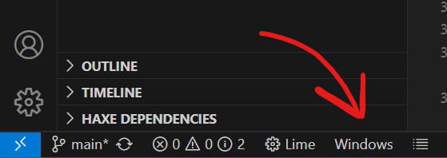

# 1. Downloading Your Environment

If you don't have it already, it is strongly advised that you download [VS Code](https://code.visualstudio.com/), as 
it has great support for HaxeFlixel!

(Note that when you download the game's code and open it in VS Code, some recommended extensions will pop up in
your notifications. Make sure to ***NOT*** ignore those and download those extensions, as 
they will greatly help you with development!)

# 2. Running the Setup File

This game uses a programming language/game engine called [HaxeFlixel](https://haxeflixel.com/).
It's very robust and has extremely similar syntax to many programming languages (mostly Java), so
if you have any kind of experience with a language that uses block coding (coding with braces `{}`), 
then it will be very easy to adapt to if you want to learn it!

Simply read the `README.txt` file in the [setup](setup/README.txt) folder and follow the simple instructions it provides.

# 3. Building the Game

To actually build and run the game, simply select the 
build type (desktop STRONGLY recommended). You can find it at the bottom left
corner of the editor.

Once you're ready, press `Ctrl` + `Shift` + `B` and the game will start building!
