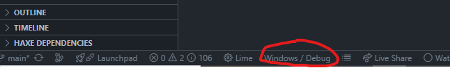

# NOTICE: THIS GAME IS A HEAVY WIP
Due to how complex this game (will) be, it will be quite some time
before even a basic demo will come out.

When one *does* come out, ***WAY*** more info will be put in here and it
will be released on [itch.io](https://itch.io) under my name (`@korithekoder`), so
when it does release, be sure to take a look!

# Contributing

If you would like to contribute to the game, then you can very gladly do so!
We appreciate every contribution made by the people who would like to help make this game
come to life. <3

For more info, please read the [contributing](CONTRIBUTING.md) file for more info.

# Development

When developing the game, it is ***strongly*** advised that you play in debug mode; that
way, multiple tools can be provided for you, such as built-in editors, tools to manipulate
entities and planets, and much more!

To access them, simply select the option for your platform (in the example shown it's Windows)
and make sure it has `/ Debug` at the end!

